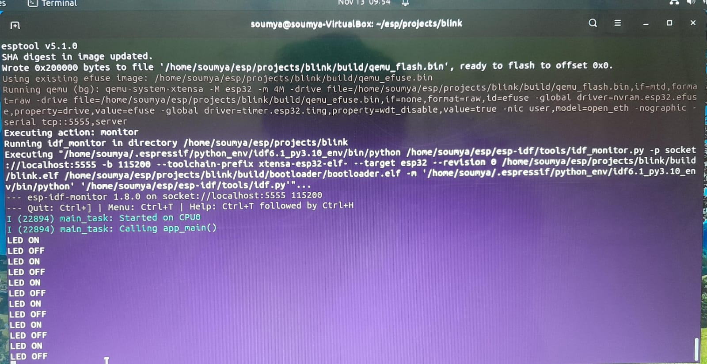
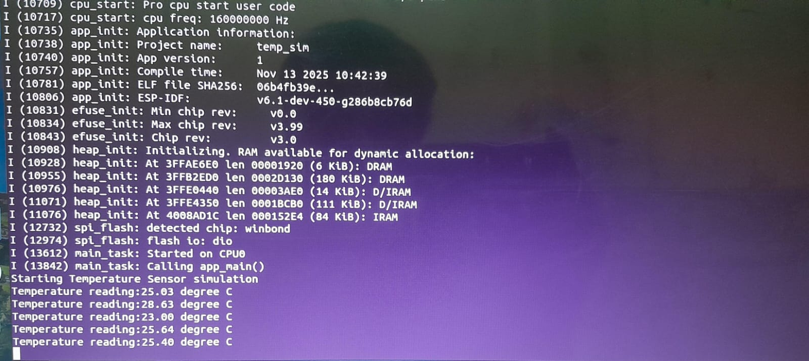

# OSHW Screening Task Report
**Project:** Build and Demonstrate ESP32 Emulation from Scratch using QEMU  
**Author:** *Soumyadip Dutta*  
**Date:** *13 November 2025*  

---

## 1. System Information

| Component | Details |
|------------|----------|
| **Operating System** | Ubuntu 22.04 (VirtualBox) |
| **QEMU Version** | qemu-esp32 (Espressif fork, version 9.2.2) |
| **ESP-IDF Version** | v6.1 |
| **Python Version** | 3.10.12 |
| **System Resources** | 16GB RAM, 2 CPU cores (VirtualBox) |

---

## 2. Objective

The goal of this project was to emulate the **ESP32 microcontroller** using **QEMU** and **ESP-IDF**, without using any physical hardware.  
Two programs were implemented and demonstrated on the emulator:

1. **LED Blink** — emulate GPIO toggling with console messages.  
2. **Temperature Sensor Simulation** — print random or predefined temperature readings periodically.

This setup establishes the foundation for integrating ESP32-based code evaluation into the **Yaksh** automated testing platform.

---

## 3. Setup Steps

### Step 1: Install Dependencies
```bash
sudo apt update
sudo apt-get install git wget flex bison gperf python3 python3-pip python3-venv cmake ninja-build ccache libffi-dev libssl-dev dfu-util libusb-1.0-0
```

### Step 2: Install ESP-IDF SDK
```bash
mkdir -p ~/esp
cd ~/esp
git clone -b --recursive https://github.com/espressif/esp-idf.git
cd ~/esp/esp-idf
./install.sh esp32
. ./export.sh
idf.py --version
```

### Step 3: Install fork of QEMU (Espressif Fork)
```bash
sudo apt-get install -y libgcrypt20 libglib2.0-0 libpixman-1-0 libsdl2-2.0-0 libslirp0
python $IDF_PATH/tools/idf_tools.py install qemu-xtensa qemu-riscv32
```

### Step 4: Create Projects
#### (a) Blink Project
```bash
cd ~
mkdir -p esp/projects
cd esp/projects
idf.py create-project blink
cd blink/main
```
Now write the `blink.c`. The `blink.c` is given here:
```c
#include <stdio.h>
#include "freertos/FreeRTOS.h"
#include "freertos/task.h"
#include "driver/gpio.h"

#define LED_PIN 2

void app_main(void)
{
    gpio_reset_pin(LED_PIN);
    gpio_set_direction(LED_PIN, GPIO_MODE_OUTPUT);

    while (1) {
        gpio_set_level(LED_PIN, 1);
        printf("LED ON\n");
        vTaskDelay(1000 / portTICK_PERIOD_MS);

        gpio_set_level(LED_PIN, 0);
        printf("LED OFF\n");
        vTaskDelay(1000 / portTICK_PERIOD_MS);
    }
}
``` 
Then in terminal:
```bash
idf.py set-target esp32
idf.py build
```
Run in QEMU:
```bash
idf.py qemu monitor
```

#### (b) Temperature Simulation
Create a new project folder `temp_sim` under `projects`:
```bash
idf.py create-project temp_sim
cd temp_sim/main
```
Now replace the `temp_sim.c` with:
```c
#include <stdio.h>
#include <stdlib.h>
#include <time.h>
#include "freertos/FreeRTOS.h"
#include "freertos/task.h"
#include "esp_system.h"

void app_main(void)
{
    srand(time(NULL));
    printf("Starting Temperature Sensor Simulation\n");

    while (1){
        float temp = 20.0 + (rand() % 1500) / 100.0; // 20.00–34.99°C
        printf("Temperature Reading: %.2f °C\n", temp);
        vTaskDelay(2000 / portTICK_PERIOD_MS);
    }
}
```
Then:
```bash
idf.py build
idf.py qemu
```

---

## 4. Demonstration Screenshots

| Program | Screenshot |
|----------|-------------|
| **Blink LED** | ** |
| **Temperature Simulation** | ** |

*Console Output Example (Blink)*  
```
LED ON
LED OFF
LED ON
LED OFF
```

*Console Output Example (Temperature Simulation)*  
```
Temperature reading:25.03 degree C
Temperature reading:28.63 degree C
Temperature reading:23.00 degree C
Temperature reading:25.64 degree C
```

---

## 5. Challenges and Fixes

| Issue | Cause | Solution |
|--------|--------|-----------|
| `idf.py` not recognized | Environment not initialized  | Ran `. ./export.sh` before running `idf.py` |


---

## 6. Reflection

This project illustrates how embedded systems development and testing can be fully virtualized using QEMU and ESP-IDF. The approach removes dependency on physical ESP32 hardware, enabling:
Automated grading of student submissions through emulated builds and console-based verification.
Safe experimentation for beginners without the risk of hardware damage.
Cross-platform reproducibility, ensuring consistent results regardless of host system.
By integrating this QEMU-ESP32 setup with Yaksh, the system can automatically compile, emulate, and verify ESP32 code submissions.
This not only standardizes the evaluation process but also democratizes embedded education — allowing students to learn and test hardware-based code virtually.


## 7. Reference Links

- [QEMU Official Documentation](https://www.qemu.org/docs/master/)  
- [ESP-IDF Get Started Guide](https://docs.espressif.com/projects/esp-idf/en/latest/esp32/get-started/index.html)  
